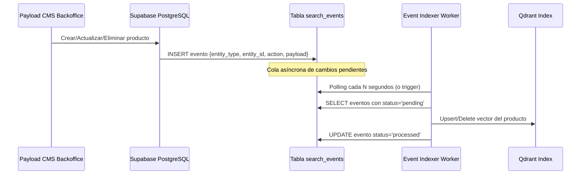
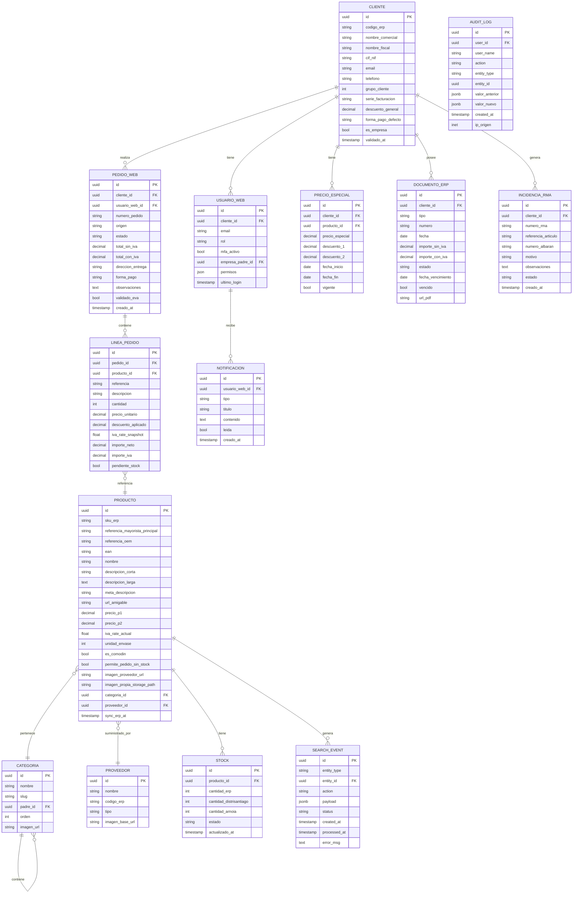

# 04 — Arquitectura del Proyecto Jeyjo

| Campo       | Valor                                      |
|-------------|--------------------------------------------|
| Versión     | 1.1                                        |
| Fecha       | 2026-05-27                                 |
| Autor       | Equipo de desarrollo Jeyjo                 |
| Estado      | Borrador                                   |

---

## 1. Visión General de la Arquitectura

La plataforma Jeyjo adopta una arquitectura **headless de tres capas** bien diferenciadas: (1) un frontend Next.js que aloja tanto la tienda pública como el área de cliente unificada B2C/B2B; (2) un backoffice Payload CMS exclusivo para el equipo interno de Jeyjo, que gestiona el catálogo, los pedidos, la sincronización bidireccional con el ERP y toda la operación de la plataforma; (3) una capa de datos compuesta por Supabase (PostgreSQL, Auth, Storage, Realtime) y Qdrant (motor de búsqueda vectorial).

Se elige este enfoque por tres razones técnicas y de negocio:

**1) Separación de responsabilidades clara:** El frontend Next.js gestiona la presentación para clientes (B2C y B2B). El backoffice Payload CMS gestiona el modelo de datos, las colecciones, la sincronización con el ERP y la lógica de negocio del back. Qdrant gestiona la búsqueda de alta velocidad. Cada capa puede escalar, modificarse o sustituirse de forma independiente.

**2) Rendimiento y SEO:** Next.js con renderizado híbrido (SSR para páginas dinámicas como la PDP con precios de cliente, ISR para páginas de catálogo con datos de baja frecuencia de cambio, SSG para páginas estáticas) permite alcanzar los Core Web Vitals exigidos por Google sin sacrificar la frescura de los datos. El buscador de tipo Booking/Amazon se apoya en Qdrant, alimentado de forma asíncrona mediante una tabla de eventos en Supabase, desacoplando la indexación del flujo principal de operaciones.

**3) Mantenibilidad por el equipo interno:** El stack Next.js + Payload CMS + Supabase + Qdrant es 100 % TypeScript, está bien documentado y tiene comunidad activa. El equipo de Jeyjo puede desarrollar, depurar y extender la plataforma sin depender de un proveedor externo de plataforma e-commerce.

La infraestructura se despliega íntegramente en **Vercel** (frontend y funciones serverless) con **Supabase** como base de datos PostgreSQL gestionada y **Qdrant Cloud** (o instancia propia) para la búsqueda vectorial. Esta elección minimiza la carga operativa de DevOps del equipo interno.

---

## 2. Diagrama de Arquitectura

```mermaid
graph TB
    subgraph "CLIENTES FINALES"
        B2C["🛒 Cliente B2C<br/>(navegador / móvil)"]
        B2B["🏢 Cliente B2B<br/>(navegador / móvil)"]
    end

    subgraph "EQUIPO JEYJO"
        ADM["⚙️ Equipo Jeyjo<br/>(Payload Backoffice)"]
    end

    subgraph "CAPA DE PRESENTACIÓN — Vercel CDN"
        NEXT["Next.js 14+<br/>App Router SSR/ISR/SSG<br/>Tienda pública + Área de cliente"]
        PAYLOAD_UI["Payload CMS<br/>Backoffice (MFA obligatorio)"]
    end

    subgraph "CAPA DE NEGOCIO — Vercel Serverless"
        PAYLOAD_API["Payload CMS API<br/>(REST + GraphQL)"]
        PRICE_ENGINE["Motor de Precios<br/>(TypeScript service)<br/>IVA snapshot en pedido"]
        SYNC_ENGINE["Sync Engine Bidireccional<br/>ERP ↔ Web (R+W)"]
        NOTIF["Notification Service"]
        IMPORT["Excel Importer<br/>(respaldo)"]
        SEO_ENGINE["SEO Auto-generator"]
        EVENT_INDEXER["Event Indexer Worker<br/>(tabla eventos → Qdrant)"]
        AUDIT_LOG["Audit Log Service<br/>(inmutable)"]
    end

    subgraph "CAPA DE DATOS"
        PG["Supabase PostgreSQL<br/>(datos enriquecidos, pedidos,<br/>usuarios web, logs, eventos)"]
        STORAGE["Supabase Storage<br/>(imágenes adjuntas propias,<br/>PDFs catálogos)"]
        REALTIME["Supabase Realtime<br/>(notificaciones push)"]
        AUTH["Supabase Auth<br/>(sesiones web clientes)"]
        QDRANT["Qdrant<br/>(índice vectorial<br/>del catálogo)"]
        EVENT_TABLE["Tabla de Eventos<br/>(cola async para Qdrant)"]
    end

    subgraph "SISTEMAS EXTERNOS"
        ERP["Avansuite ERP<br/>R+W vía API<br/>artículos, precios, clientes,<br/>proveedores, tarifas<br/>— Stock, facturas, albaranes: solo R —"]
        FTP_DS["FTP Distrisantiago<br/>(stock diario)"]
        WEB_AR["Arnoia Web Link<br/>(stock)"]
        PROV_IMG["URLs imágenes proveedores<br/>(servidas directamente,<br/>sin almacenamiento local)"]
        SKAI["SKAI / EVA API<br/>(asistente virtual IA)"]
        REDSYS["Redsys BBVA<br/>(tarjeta + Bizum)"]
        PAYPAL["PayPal / Apple Pay<br/>/ Google Pay"]
        GA4["Google Analytics 4"]
        GMC["Google Merchant Center"]
        SMTP["Resend SMTP<br/>(email transaccional)"]
    end

    B2C --> NEXT
    B2B --> NEXT
    ADM --> PAYLOAD_UI

    NEXT --> PAYLOAD_API
    NEXT --> PRICE_ENGINE
    NEXT --> SKAI
    NEXT --> QDRANT
    NEXT --> PROV_IMG
    PAYLOAD_UI --> PAYLOAD_API

    PAYLOAD_API --> PG
    PAYLOAD_API --> STORAGE
    PAYLOAD_API --> AUTH
    PAYLOAD_API --> PRICE_ENGINE
    PAYLOAD_API --> NOTIF
    PAYLOAD_API --> IMPORT
    PAYLOAD_API --> SEO_ENGINE
    PAYLOAD_API --> AUDIT_LOG
    PAYLOAD_API --> EVENT_TABLE

    PRICE_ENGINE --> PG
    PRICE_ENGINE --> ERP

    SYNC_ENGINE --> ERP
    SYNC_ENGINE --> FTP_DS
    SYNC_ENGINE --> WEB_AR
    SYNC_ENGINE --> PG

    EVENT_TABLE --> EVENT_INDEXER
    EVENT_INDEXER --> QDRANT

    AUDIT_LOG --> PG

    NOTIF --> REALTIME
    NOTIF --> SMTP

    NEXT --> REDSYS
    NEXT --> PAYPAL
    NEXT --> GA4
    PAYLOAD_API --> GMC

    style NEXT fill:#0070f3,color:#fff
    style PAYLOAD_API fill:#1a1a2e,color:#fff
    style PG fill:#3ecf8e,color:#000
    style QDRANT fill:#dc2626,color:#fff
    style EVENT_TABLE fill:#f59e0b,color:#000
    style ERP fill:#ff6b35,color:#fff
    style SKAI fill:#9b59b6,color:#fff
    style AUDIT_LOG fill:#374151,color:#fff
```

---

## 3. Patrón de Indexación Qdrant — Tabla de Eventos

El motor de búsqueda tipo Booking/Amazon se apoya en Qdrant como motor de búsqueda vectorial. La indexación sigue el patrón **Event Table Indexing** (indexación por tabla de eventos asíncronos):

La tabla `search_events` tiene la estructura:

| Campo        | Tipo      | Descripción                                           |
|--------------|-----------|-------------------------------------------------------|
| id           | uuid PK   | Identificador único del evento                        |
| entity_type  | text      | Tipo de entidad: 'producto', 'categoria', 'proveedor' |
| entity_id    | uuid      | ID de la entidad afectada                             |
| action       | text      | 'create', 'update', 'delete'                          |
| payload      | jsonb     | Datos de la entidad para indexar (nombre, descripción, referencias, etc.) |
| status       | text      | 'pending', 'processing', 'processed', 'error'         |
| created_at   | timestamp | Cuándo se generó el evento                            |
| processed_at | timestamp | Cuándo fue procesado por el worker                    |
| error_msg    | text      | Mensaje de error si status='error'                    |

Este patrón garantiza: (1) la operación principal (guardar el producto) no se bloquea esperando la indexación; (2) si Qdrant está temporalmente no disponible, los eventos quedan en la cola y se procesan en cuanto se recupera; (3) trazabilidad completa de qué está indexado y qué está pendiente.

---

## 4. Módulos Principales del Sistema

### MOD-01: Frontend Next.js (Tienda pública + Área de cliente)
- **Responsabilidad única:** Renderizar la interfaz de usuario de la tienda pública y el área de cliente (B2C y B2B), consumiendo las APIs de Payload, Qdrant (búsqueda) y sistemas externos. No hay una URL separada para la intranet B2B; es la misma aplicación Next.js con rutas protegidas por grupo de cliente.
- **Interfaces de entrada:** Peticiones HTTP de navegadores; respuestas de Payload CMS API; respuestas de Qdrant; respuestas de SKAI/EVA; callbacks de pasarelas de pago; URLs de imágenes de proveedores (servidas directamente).
- **Interfaces de salida:** HTML/CSS/JS renderizado al navegador; peticiones a Payload API; queries a Qdrant; eventos a GA4; llamadas a SKAI API; requests a Redsys/PayPal.
- **Dependencias:** MOD-02 (Payload API), MOD-03 (Motor de Precios), MOD-04 (Supabase Auth), MOD-07 (Qdrant), MOD-08 (Integración SKAI).

### MOD-02: Payload CMS (Backoffice + API)
- **Responsabilidad única:** Gestionar el modelo de datos enriquecido del catálogo, los pedidos web, los clientes web, la sincronización bidireccional con el ERP, el log de acciones y exponer una API segura para el frontend y el backoffice. Acceso restringido al equipo Jeyjo con MFA obligatorio.
- **Interfaces de entrada:** Peticiones REST/GraphQL del frontend; acciones del equipo Jeyjo en el backoffice; callbacks del Sync Engine; subidas de archivos Excel del equipo Jeyjo; subidas de imágenes adjuntas.
- **Interfaces de salida:** JSON de colecciones (productos, pedidos, clientes, configuraciones); escrituras hacia Avansuite vía API; eventos a la tabla `search_events`; eventos al servicio de notificaciones; datos al generador de feed GMC; entradas en el log de acciones.
- **Dependencias:** MOD-04 (Supabase PostgreSQL), MOD-03 (Motor de Precios), MOD-05 (Sync Engine bidireccional), MOD-06 (Importador Excel), MOD-09 (Audit Log).

### MOD-03: Motor de Precios (Price Engine)
- **Responsabilidad única:** Calcular el precio final de un artículo para un cliente específico aplicando las reglas de negocio de Jeyjo (P1, P2, descuento de cliente, oferta de grupo, precios especiales pactados, regla de no acumulación). Al confirmar el pedido, registra el tipo de IVA vigente en ese momento en la línea del pedido de forma inmutable.
- **Interfaces de entrada:** `{productoId, clienteId, cantidad, contexto: 'carrito'|'pedido_confirmado'}` desde frontend o Payload.
- **Interfaces de salida:** `{precioBase, descuentoAplicado, precioNeto, ivaRate, ivaSnapshot (solo en pedido confirmado), precioConIva, modoOferta}`.
- **Dependencias:** MOD-04 (datos de precios en PostgreSQL), MOD-05 (datos de precios desde ERP vía Sync Engine).

### MOD-04: Capa de Datos (Supabase)
- **Responsabilidad única:** Persistir todos los datos propios de la plataforma web: catálogo enriquecido, pedidos web, usuarios web, cola de eventos para Qdrant, log de auditoría, notificaciones y ficheros (imágenes adjuntas propias, PDFs). Las imágenes de proveedor por URL se sirven directamente desde la URL del proveedor; no se almacenan en Supabase Storage.
- **Interfaces de entrada:** Escrituras desde Payload CMS API; escrituras desde Sync Engine.
- **Interfaces de salida:** Lecturas a Payload API; eventos Realtime a frontend; autenticación JWT.
- **Dependencias:** Ninguna interna (es la capa de persistencia base).

### MOD-05: Motor de Sincronización Bidireccional (Sync Engine)
- **Responsabilidad única:** Mantener sincronizados en Supabase los datos desde Avansuite (artículos, precios, proveedores, tarifas, clientes, stock, facturas, albaranes) mediante lectura y escritura por API, y gestionar las sincronizaciones de stock desde Distrisantiago y Arnoia.
- **Interfaces de entrada:** API Avansuite (R+W); FTP Distrisantiago; Arnoia web link; cambios de entidades en Payload que deben escribirse en el ERP.
- **Interfaces de salida:** Escrituras en Supabase PostgreSQL; llamadas de escritura a API Avansuite (nuevos/modificados artículos, clientes, tarifas).
- **Dependencias:** MOD-04 (Supabase), conexiones externas ERP/FTP.

### MOD-06: Importador/Exportador Excel (mecanismo de respaldo)
- **Responsabilidad única:** Procesar archivos Excel de los formatos de Avansuite para actualizar masivamente el catálogo en los casos no cubiertos por la API bidireccional, o para migraciones masivas puntuales.
- **Interfaces de entrada:** Archivos .xlsx subidos por el equipo Jeyjo vía backoffice.
- **Interfaces de salida:** Registros actualizados en Supabase; archivos .xlsx de exportación descargables.
- **Dependencias:** MOD-04 (Supabase).

### MOD-07: Motor de Búsqueda Qdrant
- **Responsabilidad única:** Proporcionar búsqueda vectorial de alta velocidad (<150 ms) sobre el catálogo de productos, con soporte de sugerencias semánticas, tolerancia a errores tipográficos y ranking por relevancia.
- **Interfaces de entrada:** Queries de búsqueda desde el frontend Next.js; eventos de actualización desde la tabla `search_events` vía Event Indexer Worker.
- **Interfaces de salida:** Lista de productos relevantes con scores de relevancia, miniaturas y metadatos básicos para el desplegable del buscador.
- **Dependencias:** MOD-04 (tabla search_events en Supabase).

### MOD-08: Servicio de Notificaciones
- **Responsabilidad única:** Gestionar y distribuir notificaciones proactivas a clientes (cambio estado pedido, nueva factura, vencimiento de presupuesto) por email y mediante Supabase Realtime.
- **Interfaces de entrada:** Eventos desde Payload API (cambio de estado de pedido, nuevo documento ERP sincronizado).
- **Interfaces de salida:** Emails transaccionales vía Resend SMTP; mensajes push a Supabase Realtime channel del cliente.
- **Dependencias:** MOD-04 (Supabase Realtime), Resend SMTP externo.

### MOD-09: Audit Log Service
- **Responsabilidad única:** Registrar de forma inmutable toda acción realizada en el backoffice: creación, edición y borrado de entidades, cambios de configuración, importaciones Excel, sincronizaciones con ERP. Sin UPDATE ni DELETE posibles en la tabla de log.
- **Interfaces de entrada:** Hooks de Payload CMS que se disparan en cada operación CRUD del backoffice.
- **Interfaces de salida:** Registros en la tabla `audit_log` de Supabase con: userId, nombre operador, acción, entityType, entityId, valorAnterior (JSON), valorNuevo (JSON), timestamp, IP.
- **Dependencias:** MOD-04 (Supabase PostgreSQL con RLS policy solo INSERT).

### MOD-10: Integración SKAI/EVA
- **Responsabilidad única:** Integrar el widget del asistente virtual EVA en el frontend y proporcionar a la API de SKAI los datos de contexto necesarios para responder consultas.
- **Interfaces de entrada:** Mensajes de usuario al widget EVA; callbacks de SKAI API.
- **Interfaces de salida:** Respuestas de EVA renderizadas en el widget; pedidos generados por EVA enviados a la bandeja OMS de Payload.
- **Dependencias:** SKAI API externa, MOD-02 (Payload API para datos de contexto).

---

## 5. Modelo de Datos de Alto Nivel

> **Nota sobre `iva_rate_snapshot` en LINEA_PEDIDO:** Este campo almacena el tipo de IVA vigente en el momento de confirmación del pedido, independientemente de cambios futuros en el campo `iva_rate_actual` del producto. Es el único campo de IVA que se usa para la presentación de facturas y para la contabilidad del pedido.

> **Nota sobre imágenes en PRODUCTO:** `imagen_proveedor_url` almacena la URL remota del proveedor; se sirve directamente desde esa URL sin descarga local. `imagen_propia_storage_path` almacena el path en Supabase Storage de una imagen subida manualmente en el backoffice. Si existen ambas, la imagen propia tiene prioridad en el frontend.

---

## 6. Stack Tecnológico Propuesto

| Componente             | Tecnología                    | Justificación técnica                                                                                                     |
|------------------------|-------------------------------|---------------------------------------------------------------------------------------------------------------------------|
| Frontend               | Next.js 14+ (App Router)      | Renderizado híbrido (SSR/ISR/SSG) nativo; React Server Components para reducir JS en cliente; soporte de rutas protegidas por rol (área de cliente B2C/B2B unificada). |
| Backoffice / CMS       | Payload CMS 2.x               | CMS headless TypeScript-first; modelo de datos en código; panel de admin incluido; hooks para disparar el Audit Log y los eventos de búsqueda; licencia MIT. |
| Base de datos          | Supabase PostgreSQL            | PostgreSQL gestionado con RLS nativo para seguridad multi-tenant; Auth integrado; Storage para imágenes propias y PDFs; Realtime para notificaciones push; tabla de eventos para Qdrant. |
| Motor de búsqueda      | Qdrant                        | Motor de búsqueda vectorial y de alta velocidad; soporta búsqueda semántica y keyword; tolerancia a errores tipográficos; latencia <10 ms en búsquedas sobre 100K productos indexados; fácilmente alojable en Qdrant Cloud. |
| Indexación búsqueda    | Tabla de eventos Supabase + Worker | Desacopla la indexación del flujo principal; garantiza consistencia eventual entre el catálogo y el índice de Qdrant; resiliente a fallos temporales de Qdrant. |
| Autenticación clientes | Supabase Auth                 | JWT de corta duración; integrado con RLS de PostgreSQL; soporta OAuth si se necesita en el futuro. |
| Autenticación backoffice | Payload Auth + MFA (TOTP)   | Payload Auth para sesiones del equipo Jeyjo; TOTP obligatorio compatible con Google Authenticator. |
| Hosting frontend       | Vercel                        | CDN global; Edge Functions; preview deployments por rama; métricas de Core Web Vitals integradas. |
| Hosting backoffice/CMS | Vercel (serverless)           | Payload CMS ejecutado como Express en funciones serverless de Vercel. |
| Almacenamiento ficheros| Supabase Storage              | S3-compatible; bucket público para imágenes propias de catálogo; bucket privado para PDFs de facturas (URLs firmadas). Las imágenes de proveedor por URL se sirven desde la URL original. |
| Lenguaje               | TypeScript (estricto)         | Type safety en todo el stack; reduce errores en tiempo de ejecución. |
| Estilos                | Tailwind CSS                  | Utilidades atómicas; purge automático para bundle mínimo. |
| Testing                | Vitest + Playwright            | Vitest para tests unitarios; Playwright para tests E2E de flujos críticos. |
| CI/CD                  | GitHub Actions + Vercel        | PR checks automáticos (lint, tests, build); despliegue automático en Vercel al hacer merge a main. |
| Procesamiento Excel    | SheetJS (xlsx)                | Librería madura para parsear y generar .xlsx en los formatos de Avansuite. |
| Email transaccional    | Resend + React Email           | API sencilla; plantillas de email en React. |
| Monitorización         | Vercel Analytics + Sentry      | Core Web Vitals en tiempo real; errores de runtime con contexto de usuario. |

---

## 7. Patrones de Diseño Aplicados

| Patrón                          | Dónde se aplica                                | Por qué                                                                                              |
|---------------------------------|------------------------------------------------|------------------------------------------------------------------------------------------------------|
| Repository Pattern              | Capa de datos (Payload collections)            | Abstrae las operaciones CRUD sobre PostgreSQL; facilita el testing unitario. |
| Strategy Pattern                | Motor de precios                               | Cada estrategia de precio (P1, P2, precio especial, oferta de grupo) es una clase intercambiable. |
| Observer / Event-driven         | Tabla de eventos → Qdrant; sistema de notificaciones | Los cambios en el catálogo disparan eventos que actualizan el índice de Qdrant de forma asíncrona; los eventos de negocio disparan notificaciones. |
| Adapter Pattern                 | Integraciones externas (ERP R+W, FTP, EVA)     | Cada fuente/destino externo tiene su propio adaptador que normaliza los datos al formato interno. Si cambia la API del ERP, solo cambia el adaptador. |
| Command Pattern                 | Importador Excel; escrituras ERP               | Cada tipo de operación (importar artículos, sincronizar cliente con ERP) es un comando independiente y reutilizable. |
| Middleware Pattern              | Next.js middleware para autenticación          | Verifica el JWT y el grupo de cliente en cada petición a rutas del área de cliente. |
| Cache-aside Pattern             | Páginas de catálogo en Next.js (ISR)           | Los datos del catálogo se leen de caché; solo se regeneran cuando los datos en Supabase cambian. |
| Idempotency                     | Importador Excel; Sync Engine; Event Indexer   | Importar el mismo archivo dos veces o procesar el mismo evento dos veces no duplica datos ni genera inconsistencias. |
| Immutable Append-only Log       | Audit Log Service                              | La tabla `audit_log` solo admite INSERT; ningún rol puede hacer UPDATE ni DELETE sobre ella. Garantía de trazabilidad completa. |
| IVA Snapshot (Value Object)     | Motor de precios / Línea de pedido             | El IVA en el momento de confirmación del pedido se registra como valor inmutable en la línea; el `iva_rate_actual` del producto puede cambiar sin afectar pedidos históricos. |

---

## 8. Consideraciones de Seguridad

- **Autenticación clientes:** Supabase Auth con JWT de corta duración (15 min access token + refresh token de 30 días). MFA opcional recomendado para superadministradores B2B de empresa (TOTP).
- **Autenticación backoffice:** Payload Auth con MFA obligatorio (TOTP) para todo el equipo Jeyjo. Sin segundo factor configurado no hay acceso.
- **Autorización:** Row Level Security (RLS) de PostgreSQL activado en todas las tablas con datos de cliente. Cada cliente solo puede leer sus propias filas. Mecanismo de defensa principal contra filtración de datos entre clientes.
- **Cifrado en tránsito:** TLS 1.3 obligatorio. HSTS con preload. Vercel provee HTTPS automático.
- **Cifrado en reposo:** Supabase cifra los datos en reposo (AES-256).
- **WAF:** Reglas OWASP Top 10 en Vercel Edge (o Cloudflare si se enruta el tráfico por él).
- **Gestión de secretos:** Variables de entorno en Vercel Secrets y Supabase Vault. Nunca en el repositorio.
- **Audit Log inmutable:** Todo cambio en el backoffice genera un registro en `audit_log` con RLS policy de solo INSERT. Sin excepción.
- **Imágenes de proveedores:** Servidas directamente desde las URLs del proveedor. El navegador del cliente final hace la petición directamente a la URL del proveedor; no hay proxy ni almacenamiento intermedio. Si la URL del proveedor genera contenido malicioso, el riesgo es del cliente final y del proveedor, no del servidor de Jeyjo.
- **PDFs de facturas:** Almacenados en bucket privado de Supabase Storage. Cada descarga requiere URL firmada de corta duración (5 minutos); las URLs no son predecibles sin autenticación.
- **Pentest anual:** Se planificará un pentest externo anual en producción.

---

## 9. Consideraciones de Escalabilidad y Rendimiento

- **Volúmenes esperados:** Catálogo de entre 5.000 y 30.000 referencias activas. Clientes activos: 500-2.000 empresas B2B + usuarios B2C sin límite definido.
- **Búsqueda:** Qdrant soporta hasta millones de vectores con latencia <10 ms. Para el volumen de Jeyjo (máx. 30.000 productos), el índice es trivial. La indexación asíncrona por tabla de eventos garantiza que los cambios en el catálogo no afectan al rendimiento de las peticiones del usuario.
- **Caché diferenciada:** Páginas de catálogo anónimas: ISR con CDN Vercel (revalidación cada 5-60 min). Páginas de área de cliente autenticado: SSR con datos frescos (no se cachean en CDN).
- **Imágenes de proveedores:** Al servirse desde la URL del proveedor, el coste de ancho de banda es cero para Jeyjo. El trade-off es la disponibilidad: si el CDN del proveedor falla, las imágenes no se muestran. Para artículos estratégicos se recomienda adjuntar imagen propia en el backoffice.
- **Lazy loading:** Imágenes con `next/image` (lazy loading automático, formato WebP, responsive srcset). Las imágenes de URL de proveedor se pasan a `next/image` con el dominio del proveedor en la whitelist de `next.config.js`.
- **Usuarios concurrentes:** Vercel escala automáticamente. Supabase escala el pool de conexiones con PgBouncer. Qdrant escala horizontalmente si fuera necesario.

---

## 10. Decisiones Arquitectónicas Registradas (ADR)

| Decisión                                        | Alternativas consideradas                                     | Motivo de la elección                                                                                                            | Consecuencias                                                                                      |
|-------------------------------------------------|---------------------------------------------------------------|-----------------------------------------------------------------------------------------------------------------------------------|----------------------------------------------------------------------------------------------------|
| Payload CMS como backoffice headless            | Strapi, Directus, Sanity, WooCommerce, PrestaShop             | TypeScript-first; modelo de datos en código; hooks para Audit Log y eventos de búsqueda; licencia MIT                           | El equipo debe conocer Payload; los módulos de e-commerce deben desarrollarse desde cero           |
| Qdrant para búsqueda tipo Amazon/Booking        | Algolia, Supabase FTS (pg_search), Elasticsearch              | Latencia <10 ms; soporte vectorial nativo (útil para futura búsqueda semántica); self-hosteable; sin coste por búsqueda          | Requiere hosting separado (Qdrant Cloud o instancia propia); el equipo debe conocer la API de Qdrant |
| Indexación por tabla de eventos (async)         | Indexación síncrona, webhooks directos, CDC con Debezium      | Desacopla la operación principal de la indexación; resiliente a fallos de Qdrant; trazable; sin dependencia de herramientas externas de CDC | Consistencia eventual (el índice puede tener un retraso de segundos); requiere monitorizar la cola de eventos |
| Supabase como base de datos y autenticación     | PlanetScale, Railway PostgreSQL, MongoDB Atlas, Firebase      | PostgreSQL con RLS nativo; Auth integrado; Storage para imágenes propias; Realtime para notificaciones; tabla de eventos para Qdrant | Vendor lock-in parcial; coste escala con el uso                                                   |
| Vercel como hosting                             | Railway, Fly.io, AWS ECS, VPS propio                          | Zero-config con Next.js; CDN global; preview deployments; sin gestión de infraestructura                                         | Límites en funciones de larga duración (relevante para importaciones masivas)                      |
| Sincronización ERP bidireccional vía API        | Solo lectura API + Excel para todo, o acceso directo a BD ERP | La API bidireccional es más fiable, en tiempo real y auditable que Excel manual                                                  | Requiere confirmar los endpoints de escritura de Avansuite antes del desarrollo; Excel sigue como respaldo |
| Imágenes de proveedor: servidas desde URL       | Descargar y almacenar localmente en Supabase Storage          | Coste de almacenamiento cero para imágenes de proveedor; actualización automática si el proveedor actualiza la imagen             | Disponibilidad dependiente del CDN del proveedor; si la URL falla, no hay imagen                  |
| MFA obligatorio backoffice; opcional área cliente | MFA opcional en todos; MFA obligatorio en todos              | El backoffice tiene acceso total a datos sensibles; el área de cliente tiene acceso solo a los datos propios del cliente logueado | Mayor fricción en el acceso al backoffice para el equipo Jeyjo (justificada por la sensibilidad de los datos) |
| IVA snapshot en línea de pedido                 | Calcular IVA a posteriori desde el producto actual            | Los tipos de IVA pueden cambiar (ej. cambios legislativos); los pedidos históricos deben reflejar el IVA vigente cuando se confirmaron, no el actual | Requiere copiar el `iva_rate_actual` del producto a `iva_rate_snapshot` de la línea al confirmar el pedido; no hay query dinámica de IVA sobre pedidos históricos |
| RLS de PostgreSQL para aislamiento de clientes  | Middleware de aplicación, queries con filtros manuales        | RLS garantiza aislamiento a nivel de base de datos; defensa en profundidad independiente de bugs de la aplicación                 | Requiere diseño cuidadoso de policies; depuración más compleja                                     |

---

## Pendientes y Decisiones Abiertas

1. **Responsable: Equipo dev** — Decidir el hosting de Qdrant (Qdrant Cloud vs Fly.io vs Railway) y dimensionar el plan antes del sprint de búsqueda.
2. **Responsable: Equipo dev** — Evaluar si las importaciones Excel masivas pueden ejecutarse en funciones serverless de Vercel (límite 300s en Pro) o si requieren un worker asíncrono en Supabase Edge Functions.
3. **Responsable: Equipo dev + SKAI** — Definir el contrato de API con SKAI: endpoints, autenticación y datos de cliente logueado que pueden inyectarse en el contexto de EVA.
4. **Responsable: Equipo dev** — Definir la frecuencia de polling del Event Indexer Worker (o usar pg_notify de PostgreSQL como alternativa al polling) y el umbral de alerta si la cola de eventos supera N registros pendientes.

---

## Historial de Cambios

| Versión | Fecha      | Autor                      | Descripción del cambio                                                                                                        |
|---------|------------|----------------------------|-------------------------------------------------------------------------------------------------------------------------------|
| 1.0     | 2026-05-27 | Equipo de desarrollo Jeyjo | Creación inicial del documento                                                                                                |
| 1.1     | 2026-05-27 | Equipo de desarrollo Jeyjo | Qdrant como motor de búsqueda con patrón tabla de eventos; diagrama actualizado con MOD-07/09; modelo ER con iva_rate_snapshot, search_events, audit_log y imagen dual; MFA obligatorio backoffice; sincronización ERP bidireccional; imágenes proveedor desde URL sin storage; Area de cliente unificada B2C+B2B en Next.js |
